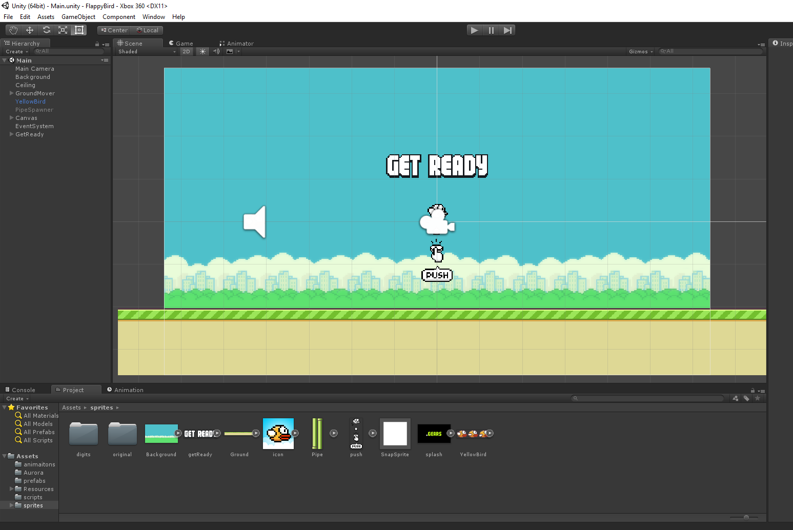
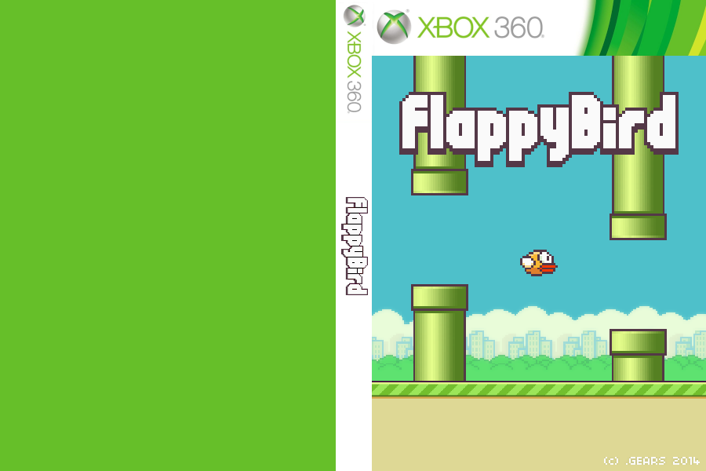

<h1 align="center">Xbox 360 Flappy Bird</h1>

  

## :dart: About ##

I did this just for fun/learning and never thought anyone would actually use it until I randomly got recommended the YouTube review and recognized it was my game :D !!!  
I first posted about it on reddit:
- https://www.reddit.com/r/360hacks/comments/k6vv4i/flappybird_on_xbox_360
- https://www.reddit.com/r/360hacks/comments/t5s8h8/flappy_bird_xbox_360

It was only ever shared to 1 random person who asked for it privately. After a while someone told me it got added to a stealth server's homebrew apps store, not sure which, and from there it spread I guess.
I got nothing from it, not even recognition. I wasn't allowed to post the code or XEX on the subreddit, that's why I never made it public.

I later added multiplayer support, not sure if the version that got spread has it, connect a second controller and press A to try it.

  

This port was made using Unity with the Xbox 360 plugin.
Sprites are straight from the original Android and Amazon Fire versions of the game
Tried my best to match the original gameplay gravity, jumps, collision boxes, spacing between pipes, etc

## :clapper: Video Review ##

https://youtu.be/XI45bFBhuLM&t=888

## :checkered_flag: Installation ##

- Download the XEX from [releases](https://github.com/joojoooo/FlappyBird/releases)
- Transfer the XEX and Media folder to your Xbox
- Launch as any other game (modded 360 needed)
- Optionally add the custom boxart to Aurora using [AuroraAssetEditor](https://github.com/XboxUnity/AuroraAssetEditor/releases/latest)

